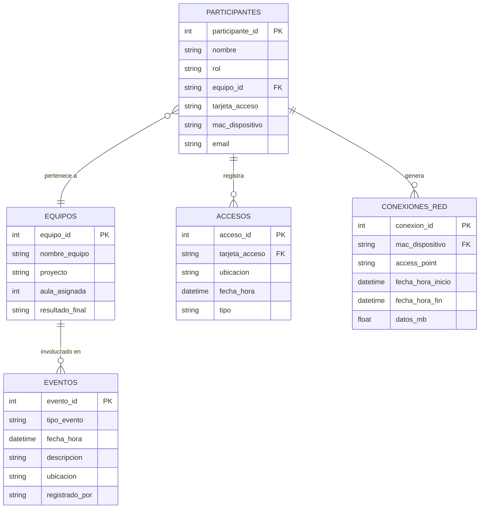

# 📊 Modelo de Datos — Operación Hackathon

## Diagrama de Relaciones (ERD)

## Relaciones para el Modelo Semántico

| Origen | Campo | Destino | Campo | Cardinalidad |
|--------|-------|---------|-------|--------------|
| `accesos` | `tarjeta_acceso` | `participantes` | `tarjeta_acceso` | N:1 |
| `conexiones_red` | `mac_dispositivo` | `participantes` | `mac_dispositivo` | N:1 |
| `participantes` | `equipo_id` | `equipos` | `equipo_id` | N:1 |

## Medidas y Definiciones (Lenguaje Natural)

| Medida | Definición | Pregunta ejemplo |
|--------|-----------|------------------|
| **Accesos nocturnos** | Registros de acceso entre las 22:00 y las 06:00 | "¿Quién accedió al aula de noche?" |
| **Último acceso por persona** | El registro de acceso más reciente de cada tarjeta | "¿Cuándo fue la última vez que entró Marcos?" |
| **Tiempo en red** | Diferencia entre fecha_hora_fin y fecha_hora_inicio de conexión | "¿Cuánto tiempo estuvo conectado cada uno?" |
| **Conexiones al AP del Aula 3** | Conexiones donde access_point = 'AP-AULA3' | "¿Quién se conectó al WiFi del Aula 3?" |
| **Accesos al Aula 3** | Accesos donde ubicacion = 'Aula 3' | "¿Quién entró al Aula 3?" |
| **Solapamiento horario** | Personas con acceso Y conexión en la misma franja | "¿Quién estaba físicamente Y conectado a la vez?" |
| **Transferencia de datos sospechosa** | Conexiones con datos_mb > 50 en horario nocturno | "¿Alguien descargó mucho de noche?" |
| **Eventos por ubicación** | Conteo de eventos agrupado por ubicación | "¿Qué pasó en el Aula 3 esa noche?" |

## Notas para Fabric

1. Importar los 5 CSV como tablas en el Lakehouse
2. Crear las 3 relaciones indicadas arriba
3. En el modelo semántico, añadir las medidas como descripciones de columna o medidas DAX
4. El Data Agent usará estas definiciones para interpretar preguntas en lenguaje natural
